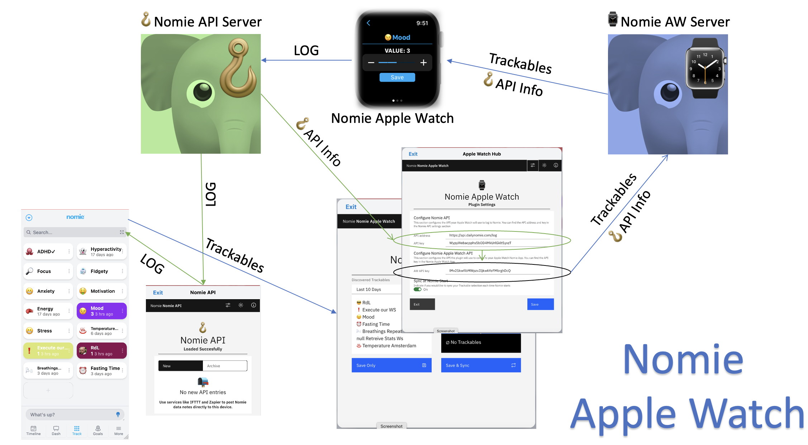
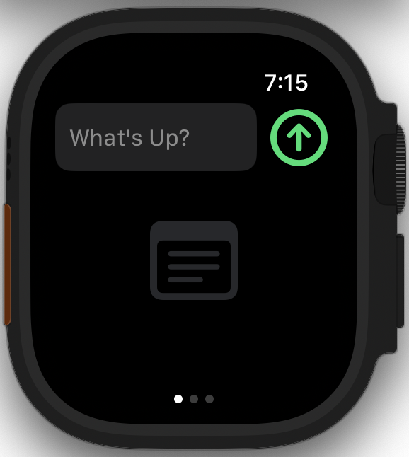
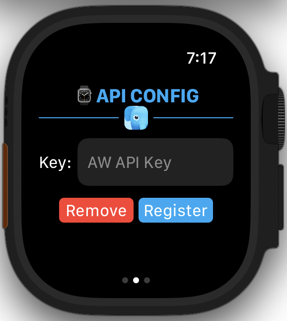
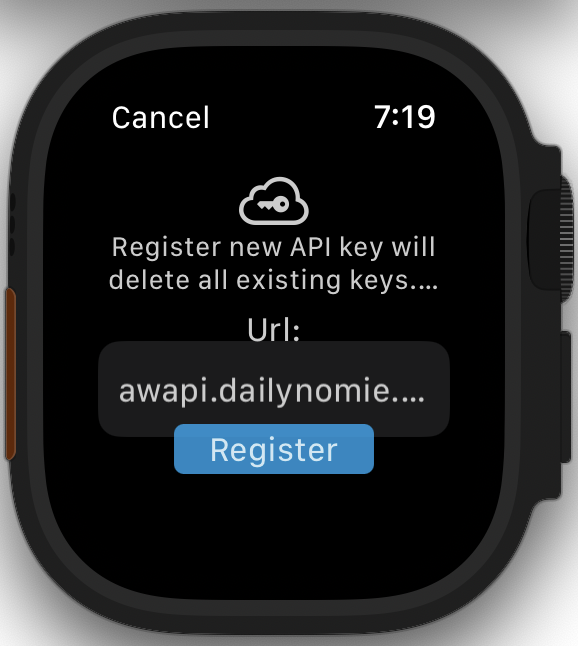
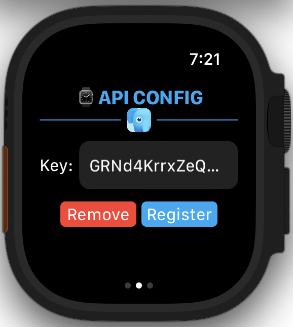
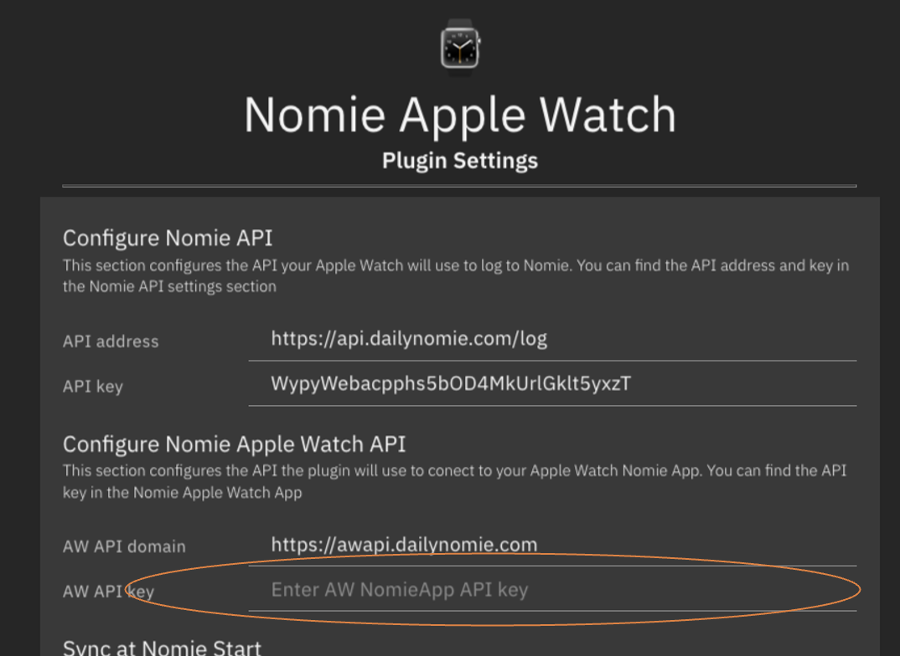
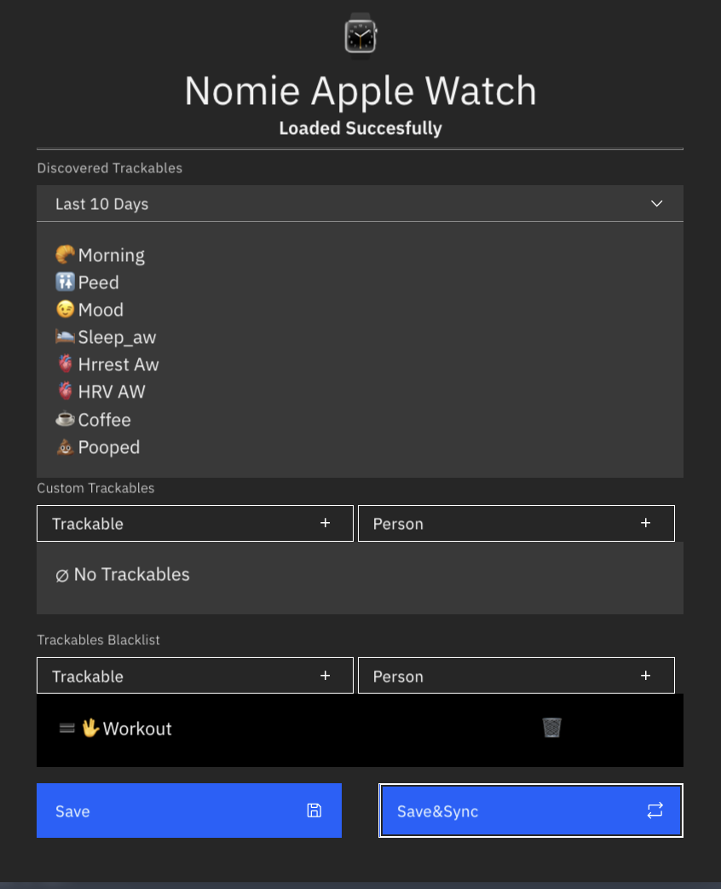
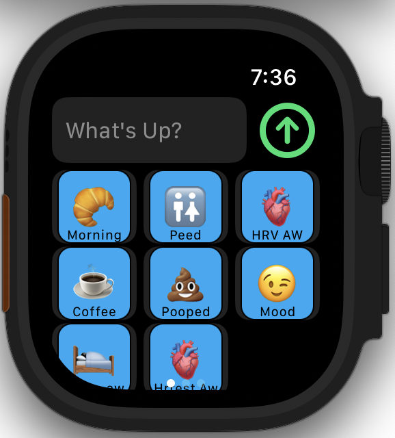
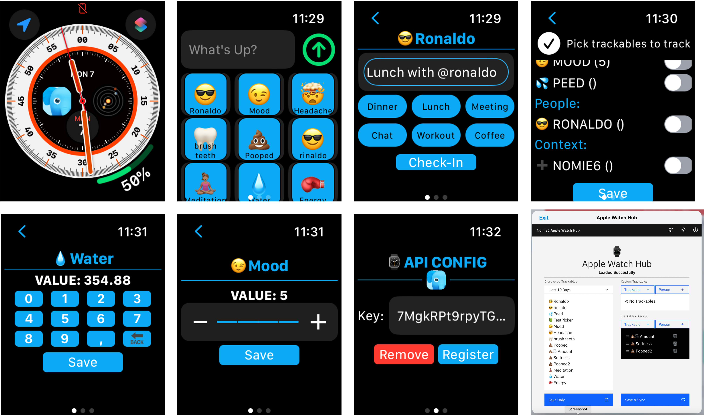

# The Nomie Apple Watch App

The Nomie Apple Watch App is an application which runs on your Apple Watch and which enables you to quickly log items to Nomie from your Apple Watch

## Before you begin....

Please be aware that this app is very experimental. This is my first (and only) Apple Watch app and the implementation is definately not the most elegant.
Anyway...feel free to contribute/enhance the code if you wish.

The Nomie Apple Watch App will only work in conjunction with the following Plugins and software:

* The ⌚️Nomie Apple Watch Plugin.
* The Apple Watch Api Server => to sync your Trackables you want to use with the Apple Watch App to.
* The Nomie Apple Watch App  (of course....) => the app to enable you to log Trackables and other info on your Apple Watch.
* The Nomie API Server => to receive logs from your Apple Watch
* The 🪝Nomie API Plugin => sync with the API server and save logs to Nomie

In general, the setup looks as shown below. I will explain in some more details in the paragraphs to follow.

### The Apple Watch API Server

Instructions on installing the Apple Watch API server can be found at:

[https://github.com/RdeLange/nomie-server-awapi](https://github.com/RdeLange/nomie-server-awapi)

## The Nomie API Server

Instructions on installing the Nomie API server can be found at:

[https://github.com/RdeLange/nomie-server-api](https://github.com/RdeLange/nomie-server-api)

## The Nomie API client Plugin

Instructions on installing the 🪝Nomie API Plugin can be found at:

[https://github.com/RdeLange/nomie-plugin-api](https://github.com/RdeLange/nomie-plugin-api)

Please make sure to configure the plugin as per instructions.

## The Nomie Apple Watch Plugin

Instructions on installing the Nomie Apple Watch Plugin can be found at:

[https://github.com/RdeLange/nomie-plugin-applewatch](https://github.com/RdeLange/nomie-plugin-applewatch)

Please make sure to configure the plugin as per insyructions. The only part you will not be able to configure yet is the API key for the Apple Watch API. This key will be generated from the Apple Watch app for which the instructions will follow below.

## The Nomie Apple Watch app

You can install the Nomie Apple Watch app via the Apple Testflight beta testing program via the following link:

LINK TO BE INCLUDED

The app is a stand alone Aple Watch app and does not come with an related Iphone/Ipad app.

Now you can open the app on your Apple watch. Initially you will be presented with an empty screen:

In order to enable the app you will have to generate a new Nomie Apple Watch API key to onboard on the API. You can do so by swiping to the left. You will be presented with the following screen:

Please click on the Register button which will lead you to the registration screen:

Please fill in the domain where your Apple Watch API server is hosted. Alternatively you can use awapi.dailynomie.com which is my personal server setup, supported on best effort.

After clicking on the Register button, the initial screen will appear, now including a registration key:

The generated key should now be configured in the ⌚️Nomie Apple Watch Plugin to enable to sync the app with Nomie.

Normally it is not possible to copy any information from the Apple Watch and paste it on your Iphone or desktop...and of course you can always manually type the info on the Nomie Apple Watch Plugin.

But there is a trick: when you click on the Key field on the apple watch, it will bring you to the edit screen. When you have hand-off enabled on your Iphone, you get the option to use the Iphone virtual keyboard to edit the text on your Apple Watch....and on your Iphone you are then able to copy the info!

Now register the key in the Nomie Apple Watch Plugin:

Next, configure the Nomie Apple Watch Plugin as per instructions in the documentation (see link above) and finally click on the save&sync button in the Nomie Apple Watch Plugin:

Now, switch back to the Apple Watch app and swipe back to the initial (first) screen. You should see the different trackables as configured in the Plugin:

## Using the App

Now that you are settles you can use the app by clicking on a trackable and logging the information, or use the What's Up? field to log free format text to Nomie.

Below is an impression of the different options:

